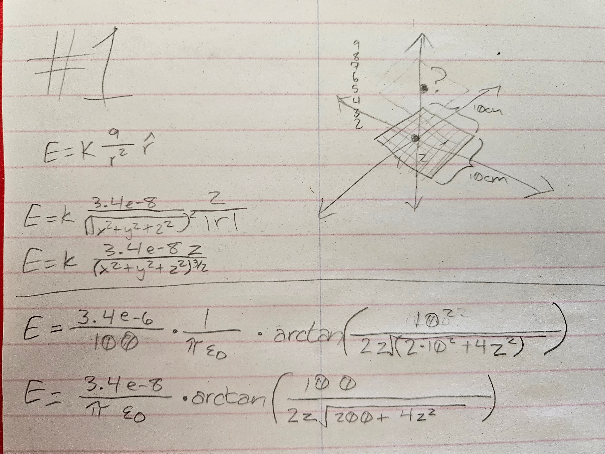
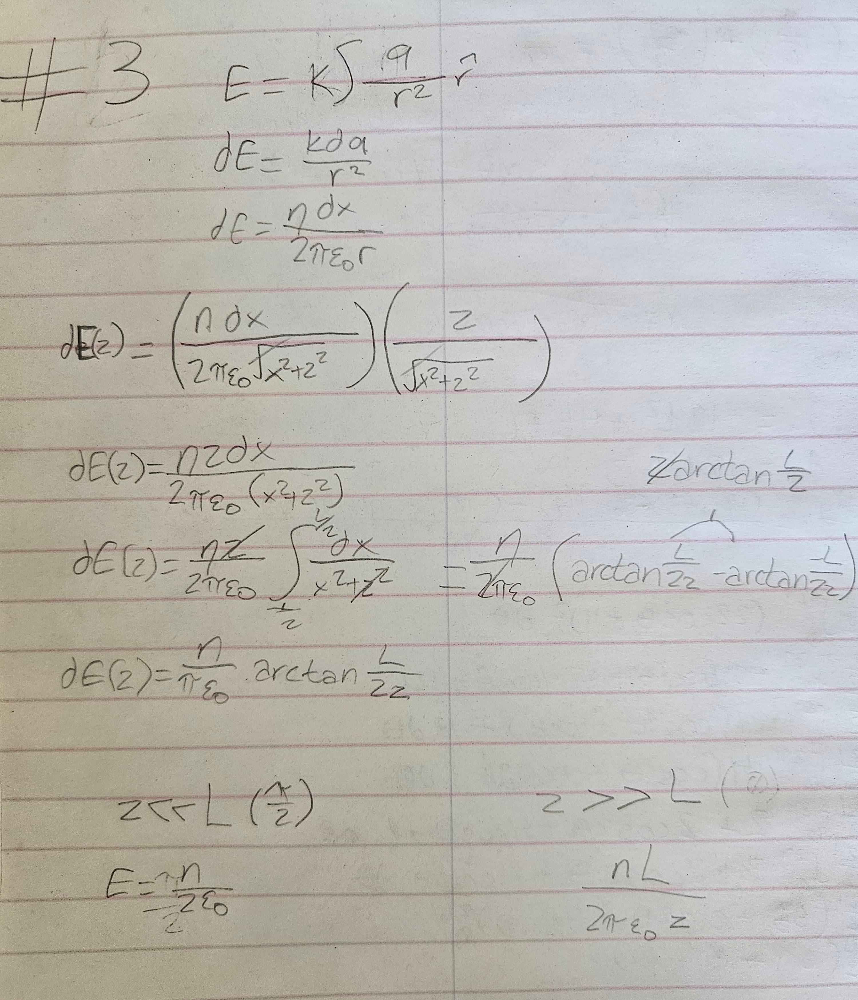

```{python}
import polars as pl
import numpy as np
import math
from lets_plot import *
import matplotlib.pyplot as plt

LetsPlot.setup_html(isolated_frame=True)
```

## Question 1: Numerical vs Analytical

Thought process:
{width=400px}

```{python}
k = 8.99e9
permittivity = 8.85e-12
z_vals = [2,3,4,5,6,7,8,9]
E_vals = []
E_calcs = []

for l in range (8):
    z = (l+2)/100
    varE = 0
    for i in range(10):
        x = -0.045+( i/100 )
        for j in range(10):
            y = -0.045+( j/100 )
            varE += ( k*3.4e-8*z  ) / ( x**2 + y**2 + z**2 )**1.5
    E_vals.append(varE)
    E_calcs.append( ( 3.4e-8/( math.pi * permittivity ) ) * math.atan( 100 / ( 2*z * math.sqrt( 200 + 4*z**2 ) ) )  )

adf = pl.DataFrame({"distance":z_vals,"numfield":E_vals,"calfield":E_calcs})
aplot = (
    ggplot(adf,aes(x="distance",y="numfield"))
    +geom_smooth(method="loess",color="#808000",size=1.2,se=False)
    +geom_smooth(method="loess",color="green",size=1.2,se=False)
)
aplot
```

# Question 2: Electric field plotted (visual)

I am not familiar with this type of plotting on python yet, so I did use a lot of Vibe coding for this question. However, the equation was provided so I assume this question was only for experimentation.

```{python} 
#this is mostly AI gen!! i have not gotten this far into python

x = np.linspace(-10, 10, 20)
y = np.linspace(-10, 10, 20)
varX, varY = np.meshgrid(x, y)
i = 3*varX+varY**2
j = 6*varX*varY

# --- Vector Plot (Quiver) ---
plt.figure(figsize=(6, 6))
plt.quiver(varX, varY, i, j, color="blue")
plt.title(r"Vector Plot: $\vec{E} = (3x + y^2)\hat{i} + (6xy)\hat{j}$")
plt.xlabel("x")
plt.ylabel("y")
plt.grid(True)
plt.xlim(-10, 10)
plt.ylim(-10, 10)
plt.show()

# --- Stream Plot ---
plt.figure(figsize=(6, 6))
plt.streamplot(varX, varY, i, j, color="red", density=1.2)
plt.title(r"Stream Plot: $\vec{E} = (3x + y^2)\hat{i} + (6xy)\hat{j}$")
plt.xlabel("x")
plt.ylabel("y")
plt.grid(True)
plt.xlim(-10, 10)
plt.ylim(-10, 10)
plt.show()
```

# Question 3: Electric field vs z vector

Thought process:
{width=400px}
```{python}
q = 1e-6
z_vals = np.linspace(0.001, 0.3, 300)
E_vals = ( q / ( math.pi*permittivity ) ) * np.arctan( 0.1/( 2 * z_vals ) )
cdf = pl.DataFrame({"z": z_vals, "E": E_vals})

cplot = (
    ggplot(cdf, aes(x="z", y="E"))
    + geom_line(se=False,method="loess",color="black", size=1.2)
)
cplot
```